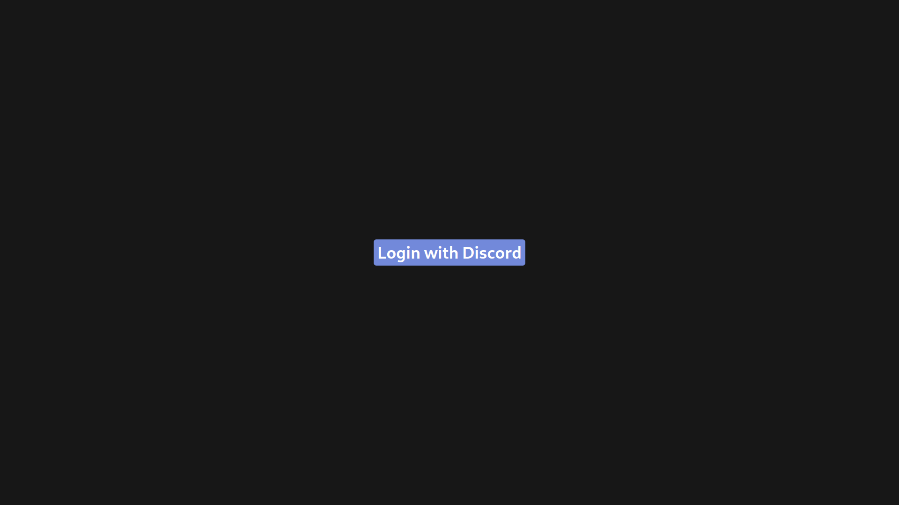

# parcel-discord-auth

simple template that has discord oauth all setup, based off of my [simple-parcel-template](https://github.com/maxhu08/simple-parcel-template)

## getting started

run these commands:

```shell
# clone
git clone https://github.com/maxhu08/parcel-discord-auth
cd parcel-discord-auth

# remove git info
rm -rf .git

# install dependencies
bun i
```

go to the discord developer portal [here](https://discord.com/developers/applications)

create a new application

go to oauth2 > add redirect & set it to `http://localhost:1234/auth/discord`

go to auth2 url generator below it > check identify > select redirect url to the one you set earlier > copy generated url

then set the `a` tag with id `login`, replace the href value of `#` with the url from the discord developer portal, but replace `response_type=code` with `response_type=token`

that's it !

to run:

```shell
# development mode
bun dev

# production mode
bun build
```

then go to the link it gives, which will probably be `localhost:1234`




